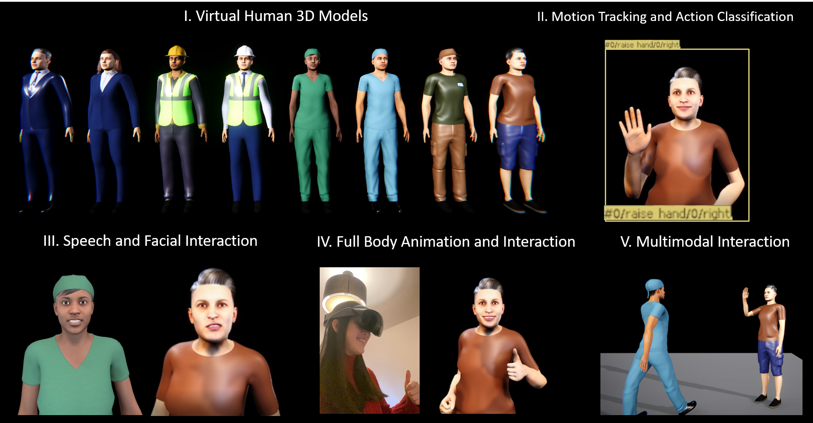
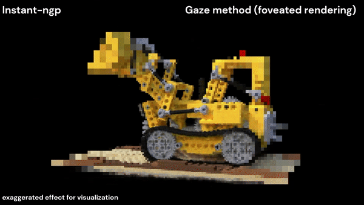
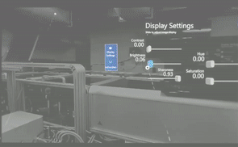
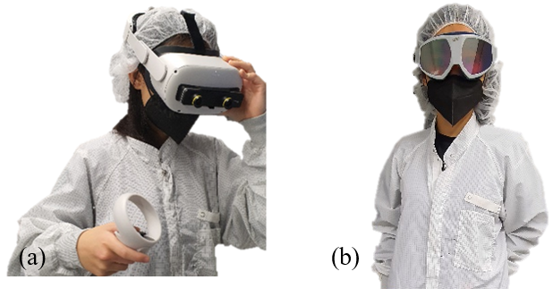
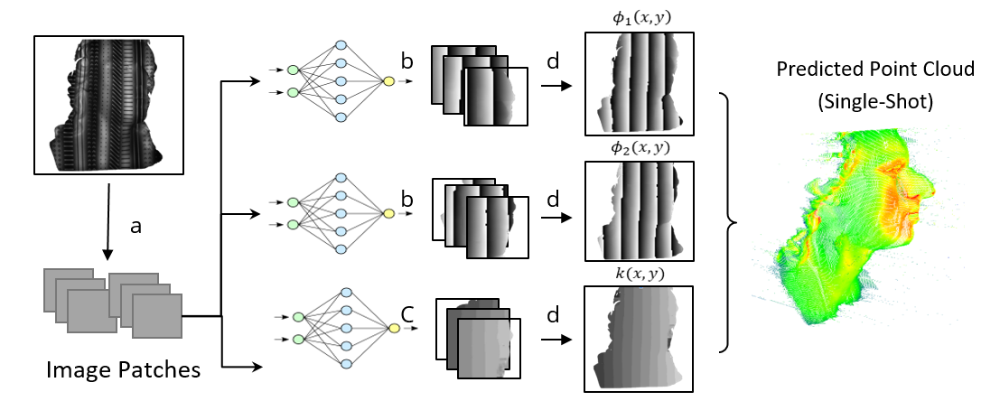



## 2025

<link rel="stylesheet" href="../assets/css/publication_main.css">

  

  
I Hear, See, Speak & Do: Bringing Multimodal Information Processing to Intelligent Virtual Agents for Natural Human-AI Communication

  

    <a>Ke Li*</a>,
    Fariba Mostajeran*,
    Sebastian Rings,
    Lucie Kruse,
    Susanne Schmidt,
    Michael Arz,
    Erik Wolf,
    Frank Steinicke
  

  
    <a href="https://doi.org/10.1109/VRW66409.2025.00469">2025 IEEE Conference on Virtual Reality and 3D User Interfaces Abstracts and Workshops (VRW 2025)</a>
  

  

    <a href="https://doi.org/10.1109/VRW66409.2025.00469">Paper</a>/
    <a href="">Code coming soon</a>/
    <a href="https://www.youtube.com/watch?v=BTKCyC0GgXg">Video </a> 
  

  

    This technical demo explores multimodal information processing techniques (e.g.facial expression, body actions) to enable intelligent virtual agents for natural human–AI communication in immersive extended reality environments.
  

   

  
  
  
A Toolkit for Creating Intelligent Virtual Humans in Extended Reality
 

  

    Fariba Mostajeran*,
    <a>Ke Li*</a>,
    Sebastian Rings,
    Lucie Kruse,
    Erik Wolf,            
    ,
    Susanne Schmidt,
    ,
    Michael Arz,
    ,
    Joan Llobera,
    ,
    Pierre Nagorny,
    ,
    Caecilia Charbonnier,
    ,
    Hannes Fassold,
    ,
    Xenxo Alvarez,
    ,
    André Tavarest,
    ,
    Nuno Santos,
    ,
    João Orvalho,
    ,
    Sergi Fernández,
    ,
    Frank Steinicke
  

  <a href="https://ieeexplore.ieee.org/abstract/document/10972741">2025 IEEE Conference on Virtual Reality and 3D User Interfaces Abstracts and Workshops (VRW)</a>

  

    <a href="https://ieeexplore.ieee.org/abstract/document/10972741">Paper</a>/
    <a href="">Code coming soon..</a>
  

  

    This workshop paper presents the entire technical stack of the Intelligent Virtual Human technology developed within the EU project <a href="https://presence-xr.eu/"> PRESENCE </a>, including virtul human creation, real-time action recognition, physics based animation, and speech and facial interactions. 
  

## 2024

  
  
  
Reality Fusion: Robust Real-time Immersive Mobile Robot Teleoperation with Volumetric Visual Data Fusion
 

  

    <a>Ke Li</a>,
    Reinhard Bacher,
    Susanne Schmidt,
    Wim Leemans,
    Frank Steinicke
  

  <a href="">2024 IEEE/RSJ International Conference on Intelligent Robots and Systems (IROS 2024, oral presentation) </a>
  

    <a href="https://arxiv.org/abs/2408.01225">Paper</a>/
    <a href="https://github.com/uhhhci/RealityFusion">Code</a>/
    <a href="https://youtu.be/qrnzmbWyXRA">Video </a> 
  

  

      A high performance and robust immersive robot teleoperation system that combines the best of both worlds: the high fidelity of neural rendering (3D Gaussian Splattings) and real-time stereoscopic point cloud projection. 
  

   

  
  
  
Magic NeRF Lens: Interactive Fusion of Neural Radiance Field for Virtual Facility Inspections
 

  <a href="">Frontiers in Virtual Reality </a>

  

    <a>Ke Li</a>,
    Susanne Schmidt,
    Tim Rolff,
    Reinhard Bacher,
    Wim Leemans,
    Frank Steinicke
  

  

    <a href="https://www.frontiersin.org/journals/virtual-reality/articles/10.3389/frvir.2024.1377245/full">Paper</a>/
    <a href="https://github.com/uhhhci/immersive-ngp">Code</a>/
    <a href="https://neuralradiancefields.io/magic-nerf-lens-marries-cad-files-and-nerfs-in-vr/">News </a> /
        <a href="https://youtu.be/2U4X-EaSds0">Video </a> 

  

  

      Virtual inspection and maintenance of particle accelerators by combining CAD models and NeRF models through different magic lens effects. 
  

   

## 2023

  
  
  
VRS-NeRF:Accelerating Neural Radiance Field Rendering with Variable Rate Shading
 

  

    Tim Rolff,
    Susanne Schmidt,
    <a>Ke Li</a>,
    Frank Steinicke,   
    Simone Frintrop

  

  

    <a href="https://ismar23.org/">2023 IEEE International Symposium on Mixed and Augmented Reality (ISMAR)</a> 
  

  

      <a href="https://www.inf.uni-hamburg.de/en/inst/ab/cv/media/rolf-etal-ismar2023-paper.pdf">Paper</a>
  

  

      Lightning-fast VR-NeRF rendering with variable rate shading (VRS) utilizing characteristics of human vision (e.g. visual saliency,  gaze, edges).
  

   

  
  
  
RealityGit: Cross Reality Version Control of R&D Optical Workbench
 

  

    <a>Ke Li</a>,
    Tim Rolff,
    Reinhard Bacher,
    Frank Steinicke
  

  

  

    Honorable Mention for Best Design at ISMAR 2023 Student Competition
  

  
  

      <a href="https://youtu.be/pMTXwRPchSY">Video Demo</a> /
      <a href="https://www.edit.fis.uni-hamburg.de/ws/files/45479864/2023_ISMAR_Student_Design_Competition_Final.pdf">Paper</a> 
      

  

  

      Exploring ideas of using NeRF to support multi-user collaborations across the spatial-temporal realities. 
  

   

  
  
  
Immersive Neural Graphics Primitives 
 

  

    <a>Ke Li*</a>,
    Tim Rolff*,
    Susanne Schmidt,
    Reinhard Bacher,
    Simone Frintrop,
    Wim Leemans,
    Frank Steinicke
  

  

      *Equal contributions.
  

  

       IEEE Conference on Virtual Reality and 3D User Interfaces (IEEE VR) 2023
  

  

    <a href="https://arxiv.org/pdf/2211.13494.pdf">Arxiv</a> /
    <a href="https://github.com/uhhhci/immersive-ngp">Code</a>/
    <a href="https://www.youtube.com/watch?v=VgAk_A1HTNw">Video</a>
  

  

      The first open-source VR NERF Unity package that brings high resolution, low-latency, 6-DOF NeRF rendering to VR based on Nvidia's instant-ngp.
  

   

## 2022

  

  
Mixed Reality Tunneling Effects for Stereoscopic Untethered Video-See-Through Head-Mounted Displays 
 

  

    <a>Ke Li</a>,
    Susanne Schmidt,
    Reinhard Bacher,
    Wim Leemans,
    Frank Steinicke
  

  
  <a href="https://ismar2022.org/program-paper-presentations/">2022 IEEE International Symposium on Mixed and Augmented Reality (ISMAR)</a>
  

    <a href="https://ieeexplore.ieee.org/abstract/document/9995181/">Paper </a>  /
    <a href="https://github.com/keli95566/MRTunnelingPico">Code</a> /
    <a href="https://youtu.be/yIDXRc3FDJA">Video</a>

  

  

      A novel sensor fusion technique that merges VST streams with various latency and resolution and leverages human's perceptual characteristics.
  

  

  
Stereoscopic Video See-Through Head-Mounted Displays for Laser Safety: An Empirical Evaluation at Advanced Optics Laboratories 
 

  

    <a>Ke Li</a>,
    Aradhana Choudhuri,
    Susanne Schmidt,
    Tino Lang,
    Ingmar Hartl,
    Wim Leemans,
    Frank Steinicke
  

  <a href="https://ismar2022.org/program-paper-presentations/">2022 IEEE International Symposium on Mixed and Augmented Reality (ISMAR)</a>
  

    <a href="https://ieeexplore.ieee.org/document/9995082">Paper</a> /
    <a href="https://www.youtube.com/watch?v=Qj_CBB8wIVQ">Video</a> 

  

  

      The first work of using a stereoscopic VST-HMD as laser safety goggles with evaluation by 14 laser experts at DESY. 
  

  

  

  
Taming Cyclops: Mixed Reality Head-Mounted Displays as Laser Safety Goggles for Advanced Optics Laboratories 
 

  

    <a>Ke Li</a>,
    Aradhana Choudhuri,
    Susanne Schmidt,
    Ingmar Hartl,
    Wim Leemans,
    Frank Steinicke
  

    <a href="https://ieeexplore.ieee.org/document/9757385/">2022 IEEE Conference on Virtual Reality and 3D User Interfaces (IEEE VR)</a> / 
    <a href="https://ieeexplore.ieee.org/document/9757385/">Poster</a>
    
    

        A novel application of using mixed reality for eye protection for high power laser laboratories.
    

  

  

  
Towards Robust Exocentric Mobile Robot Tele-Operation in Mixed Reality
 

  

    <a>Ke Li</a>,
    Reinhard Bacher,
    Wim Leemans,
    Frank Steinicke
  

  
  <a href="https://vam-hri.github.io/">5th International Workshop on Virtual, Augmented, and Mixed Reality for HRI. (VAM-HRI) </a>
  

    <a href="https://openreview.net/pdf?id=HYIes841hJc">Paper</a> /
    <a href="https://www.inf.uni-hamburg.de/en/inst/ab/hci/projects/mrrobotics.html">Project</a> /
    <a href="https://github.com/keli95566/VAMCozmo">Code</a> 
  

  

  

  

  
Single Shot Phase Shift 3D Scanning with Convolutional Neural Network and Synthetic Fractals
 

  

    <a>Ke Li</a>,
    Spehr, Marcel,
    Höhne, Daniel,
    Bräuer-Burchardt, Christian,
    Tünnermann, Andreas ,
    Kühmstedt, Peter
  

    <a href="https://diglib.eg.org/handle/10.2312/3dor20221179"> 2022 Eurographics Symposium on 3D Object Retrieval</a> / 
    <a href="https://diglib.eg.org/handle/10.2312/3dor20221179">Paper</a>
    
    

        My master thesis work at the Fraunhofer IOF. 
    

  

  
